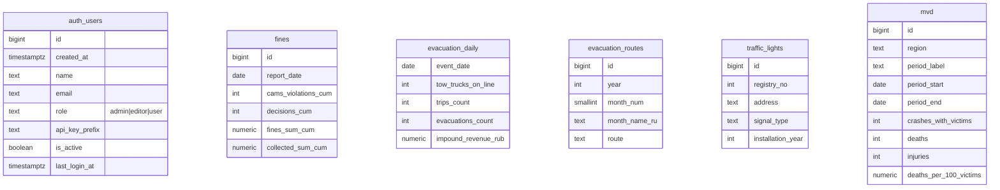

# Городовёнок

>  Современная цифровая веб-платформу для
Центра организации дорожного движения Смоленской области. Платформа
отражает социально-ориентированную миссию учреждения,
обеспечивает удобство взаимодействия с гражданами и включает
формирование единой базы данных для интеграции и расширения
функционала умной аналитики.

## Стек

 \

\

## О нас
Мы команда энтузиастов и специалистов в области искусственного интеллекта и разработки ПО:
| Имя | GitHub | Роль | Задачи |
|-----|----|------|-------------------------|
| Кравченко Алексей | [atlaso4ek](https://github.com/ATLASO4EK "Кравченко Алексей") | Тимлид, Backend | SQL, ML, API, TG-bot |
| Христофорова Алёна | [Hao_pc](https://github.com/hao-pc "Христофорова Алёна") | Техлид, Fullstack | SQL, Data Science |
| Чайкин Арсений | [Bittjs](https://github.com/Bittjs "Чайкин Арсений") | Fullstack-разработчик | Design |
| Серикова Анастасия | [moreiwi](https://github.com/moreiwi "Серикова Анастасия") | Frontend-разработчик | Design |
| Ведерников Артём | [1Evgesha1](https://github.com/1Evgesha1 "Ведерников Артём") | Backend-разработчик | TG-bot |

## БД
### Ключевые таблицы

auth_users — таблица для аутентификации пользователей и работы с логикой разграничения прав

fines — накопительные показатели штрафов по датам

evacuation_daily — ежедневная статистика эвакуаторов

evacuation_routes — маршруты эвакуации

traffic_lights — реестр светофоров

mvd — статистика ДТП из МВД.csv

### Ограничения
CHECK на неотрицательные значения,

UNIQUE по ключевым бизнес-атрибутам,

внешних ключей нет

### Принципы хранения
данные загружаются пачками из Excel/CSV через Python (pandas + SQLAlchemy),

вставка идемпотентная (UPSERT по ключам),

все таблицы в отдельной схеме city_ops

